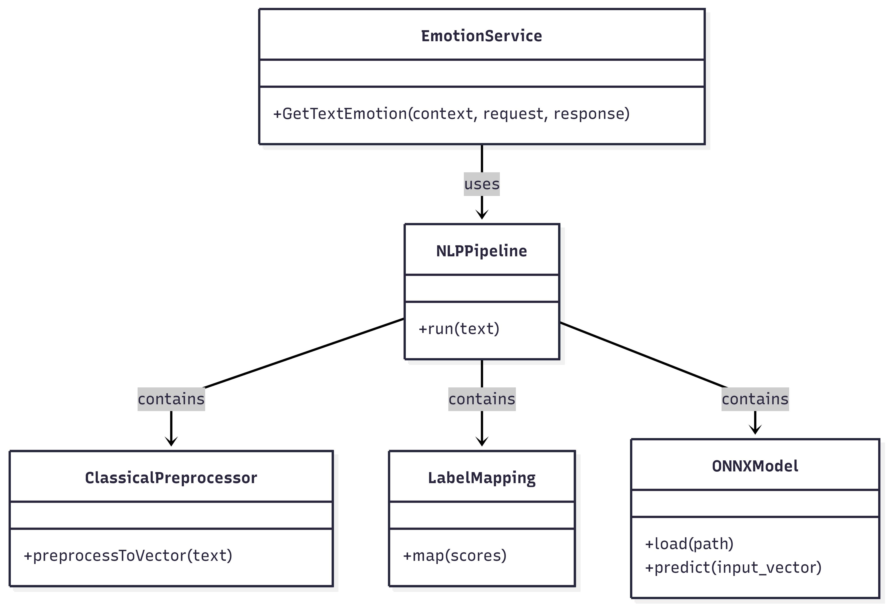

# Emotion Detection Service

C++ NLP service with modular architecture, designed for text-based emotion recognition. The project combines ONNX-based inference and gRPC.

## Features
- **Text Emotion Recognition** - classifies text input into multiple emotion labels using a pre-trained ONNX model.
  - Note: The model has been trained on limited vocabulary so far, so the predictions may not be accurate.
- **Modular C++ Architecture**
- **Full Preprocessing Implementation** - complete text preprocessing pipeline implemented as part of the project, including:
  - Lowercasing and punctuation handling
  - Tokenization and stopword removal
  - Stemming and n-gram generation
  - TF-IDF computation for vectorization and normalization of scores
- **gRPC Integration (WIP)** - provides classification as a service.
- **ONNX-Based Inference** - Uses ONNX Runtime to execute exported machine learning models.
- **Extensive Testing** -  Unit and integration tests to ensure relaibility
- **Configurable Parameters** - Key settings such as model path and others can be adjusted without code changes.

## Technology stack
### Service & Inference
 - C++ 17
 - ONNX Runtime
 - gRPC
 - Eigen

### Build & Testing
 - CMake
 - Google Test

### Model training
- Python
- sklearn

## Project structure
```
emotion_detection_service
├── docs/                # Project documentation
├── config/              # JSON files with configurable parameters for the service
├── ml/                  # Jupyter notebooks for model training and exporting to ONNX
├── src/
│ ├── generated/        # Auto-generated files from gRPC compilation
│ ├── include/          # Public header files
│ ├── nlp/              # Core NLP module containing the pipeline
│ │ ├── preprocessing/  # Text cleaning, tokenization, and vectorization
│ │ ├── model/          # ONNX model loading and inference
│ │ ├── pipeline/       # Orchestrates preprocessing, model inference, and label mapping
│ ├── protos/           # Protocol buffer definitions for gRPC service and messages
│ ├── service/          # Implementation of the gRPC service
├── tests/
│ ├── unit/             # Unit tests for individual components
│ ├── integration/       # Integration tests
```

## Architecture


## Future Improvements
- Complete gRPC Integration – Finalize service layer.
- Thread Pool for Request Handling – Improve scalability and concurrency.
- Dockerization – Provide containerized deployment for simplified setup and portability.
- Support for Transformer-Based Models (e.g., BERT exported to ONNX).
